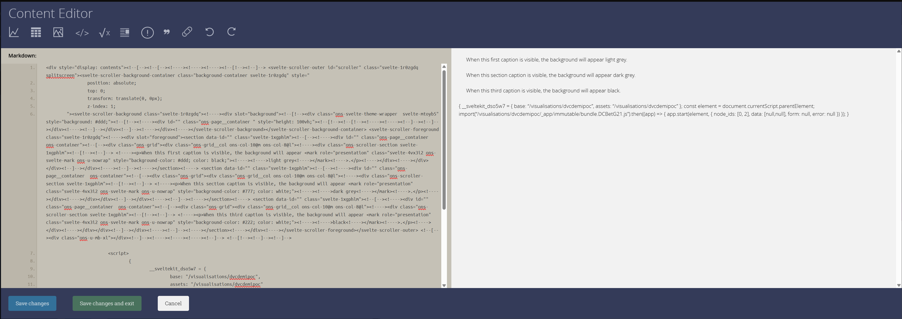

# Proof of concept for a 'demi-scrolly'

A `demi-scrolly` is the term we've come up with which is a scrolly embedded into a page. Here are two examples from The Guardian ([example one](https://www.theguardian.com/world/ng-interactive/2024/aug/08/how-russias-summer-offensive-is-reshaping-the-war-in-ukraine), [example two](https://www.theguardian.com/world/ng-interactive/2024/dec/04/how-ukraine-faced-worst-month-battlefield-in-two-years-visualised)).

## The setup

The important step is to add an option to `svelte.config.js` called `bundleStrategy` under [`output`](https://svelte.dev/docs/kit/configuration#output). With this you can tell sveltekit to create a single bundled file which has all JS and CSS in one file rather than use chunks.

You'll also need to setup the folder name in `app.config.js` to match what'll it'll be like on the live site e.g. `/visualisations/dvc3200`

## Build, preview and publish

Once you've built your thing, run the build step as usual with `npm run build`. You shall see a single `index.html` file in the `build` folder and some other bits. Zip up the contents of your `build` folder but not the `build` folder itself as that affects the paths.

Upload the zip file as a visualisation.

When you preview the visualisation, you should see what you've built in the preview. Grab the code from the index html and put it as a content block in Florence and you should see your beautiful creation.

